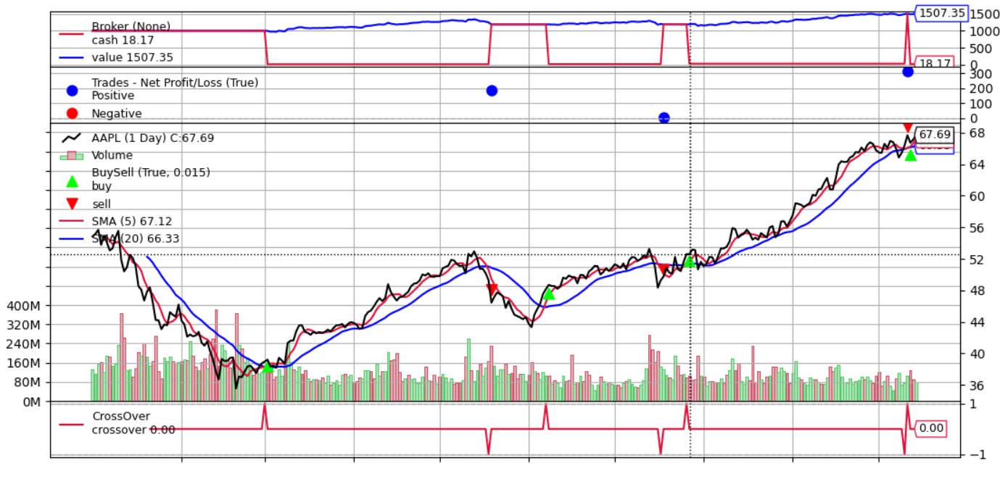

# Backtest 

Backtest (v1.0.0) helps you easily start backtesting trading algoritms with [Backtrader](https://www.backtrader.com/).



The current implementation aims to provide a fast Backtesting solution for unexperienced Python users.

## Quick Start

The following quick start guide will set up your custom installation of Backtest v1.0.0 and add historical data from your selected stocks in minutes.

### Prerequisites

Backtest runs on [Polygon](https://polygon.io/) for historical data, [Pandas](https://pandas.pydata.org/) for pre-processing and [Backtrader](https://www.backtrader.com/) for backtesting. 

You can install this libraries via PyPI.

```shell
pip install polygon-api-client
pip install backtrader
pip install pandas
```

You will also need to set up your [Polygon API key](https://polygon.io/dashboard/signup) in the first line of the `keys/.polygonkey` file.

```
{your_polygon_api_key}
```

### Setup

After you have all the needed prerequisites, continue to open `historical/LOADER.csv` and add the tickers you want to load and backtest in the future.

```
MSFT
AAPL
BRK.B
GOOG
AMZN
V
TSLA

```

Please remember to leave an empty line at the end of the file.

### Loading

To load historical price data from the selected stocks to your machine, run the `loader.py` module.

```python
python loader.py
```

The loading process takes around 1 minute for every 5 stocks in `historical/LOADER.csv`. 

The current implementation recieves the last 288 daily bars (excluding weekends) starting from two days before the current day. 

Note that as the downloaded data is static, to backtest with new market pricing, you have to run `loader.py` every day.

## Testing

After all the steps from [Quick Start](#quick-start) have been completed, you can start backtesting from `main.py`.

### Backtest Example

The following code would test a Simple Moving Average Crossover algorithm on Amazon (NASDAQ:AMZN). 

```python
from backtest.backtest import backtest
from algos.smacross import SmaCross 

backtest(SmaCross, "AMZN")
```

The previous algorithm, lcoated in `algos/smacross.py` was provided as an example by [Backtrader](https://www.backtrader.com/home/helloalgotrading/).

### Custom Backtest

To start backtesting custom algorithms, you can develop them in `algos/` using Backtrader functions and import them to `main.py`.

If you are unexperienced with python modules and imports, you can edit the provided `algos/custom.py` file and run the code that appears at the end of this section. 

The base code on `algos/custom.py` has a simple `log()` function that will print close prices in your console for every daily bar.

The following code would test the custom algorithm on Tesla, Inc. (NASDAQ:TSLA).

```python
from backtest.backtest import backtest
from algos.custom import CustomAlgoExample 

backtest(CustomAlgoExample, "TSLA")
```

### Scope

The current scope of the project is to provide a ready off-the-shelf module for users with a begginer-level of knowledge in Python. 

This way, users can only focus on learning Backtrader functions and running `main.py` to test their algorithms, without spending time on historical data gathering, pre-processing or complex Python-specific syntax.

Experienced Python developers are encouraged to, and better benefited by, building custom Backtrader modules that specificaly suit their needs, instead of using Backtest.

### Limitations

The current implementation aims to provide a fast Backtesting solution for unexperienced users, and has the following limitations.

* Recieves the last 288 daily bars (excluding weekends) starting from two days before the current day.  
* Uses the stock's Close Price as Close and also as Adjusted Close.

## License

This project is licensed under the MIT License - see the LICENSE file for details.
